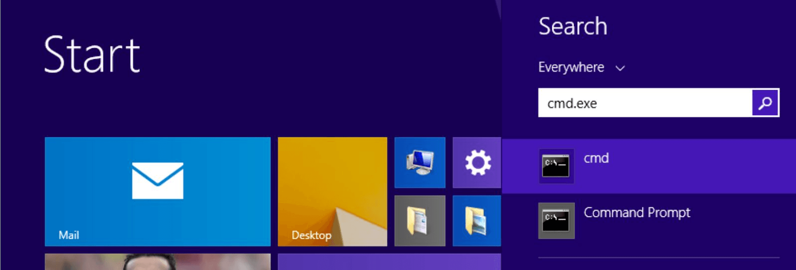
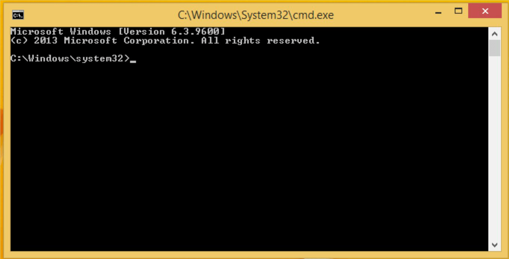
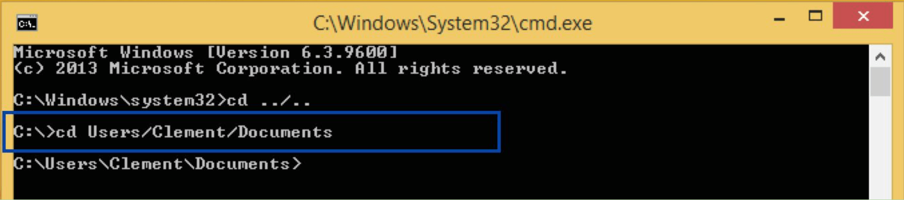
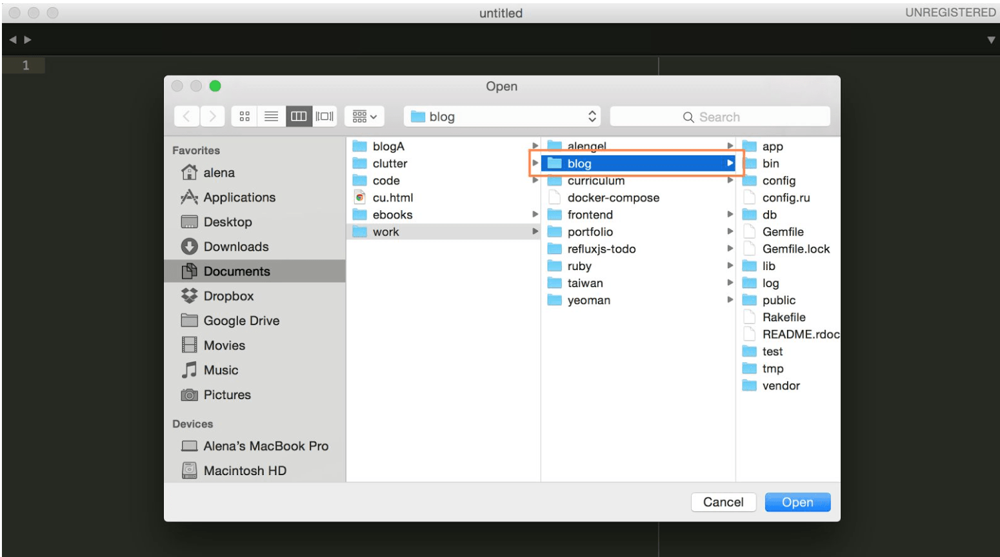

Rails makes it very easy to generate the files that you need to start building a Rails application. Just open the Terminal on a Mac or the Command prompt on Windows.

> [mac-only]
> **Mac Only**
 
 
> Go to your Applications folder and click on the Utilities folder. Then click on Terminal to open the app.
>
> 
>
> This should open the OSX terminal.
> 
>
> Now type ​`cd Documents` ​and press ​**enter** to navigate to the Documents folder.
>
>
 
 
 
> [win-only]
> Windows Only
 
 
> Press the Windows ⊞​ ​key + R to open "Run". Type cmd.exe and press **enter**.
>
> 
>
> This should open the Windows command prompt.
> 
>
> We want to create our application in a sensible place, so let’s go to a directory that makes sense. Type ​`cd../..​` into the command prompt and press **enter**.​
>
>
>
> Now, it should look like the above. Let’s go to your D​ocuments​ folder. Type ​`cd Users/your_name/Documents​` and press **enter**. ​Replace *your_name*​ with your username on your computer.
>
>

From now on we will refer to the OSX terminal and the Windows command prompt as the **​terminal**​. When you type something into the terminal, you press the **enter** ​key and the terminal will execute what you entered. Every command for the terminal will be prefixed with a​ **$** ​in this tutorial. **D​on’t** e​nter the $ when you copy and paste a command into the terminal.

So, let’s get started. Type

`$ ​rails new blog`

in your terminal and press the **enter** key. Rails will now generate all the files we need to start building a blog. Once it is finished, we need to go into the newly created folder called​ **blog** in the terminal. To do that, we type

`$ ​cd blog`

into the terminal and press **enter**.

Now we want to make sure that everything works just as expected, so we will start up our web server. Type into the terminal:

`$ ​bin/rails server` ​(Mac OS X) 
 
`$ ​ruby bin\rails server` ​(Windows) 

and press the **enter** key again. If you now type [http://localhost:3000](http://localhost:3000) in your browser, you will see this page:

This shows you that everything is set up correctly and we can get started to make our blog!

Let’s open our Sublime Text 2/3 editor to see all the files that Rails made for us. Open Sublime Text 2/3 by clicking on the application icon.

Open a folder in Sublime by navigating to File in the top bar. 

Then select the correct folder named **blog**.

You should now see the folder and all it's files in the left hand sidebar in Sublime.

