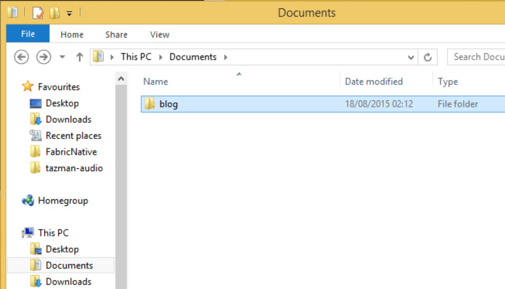
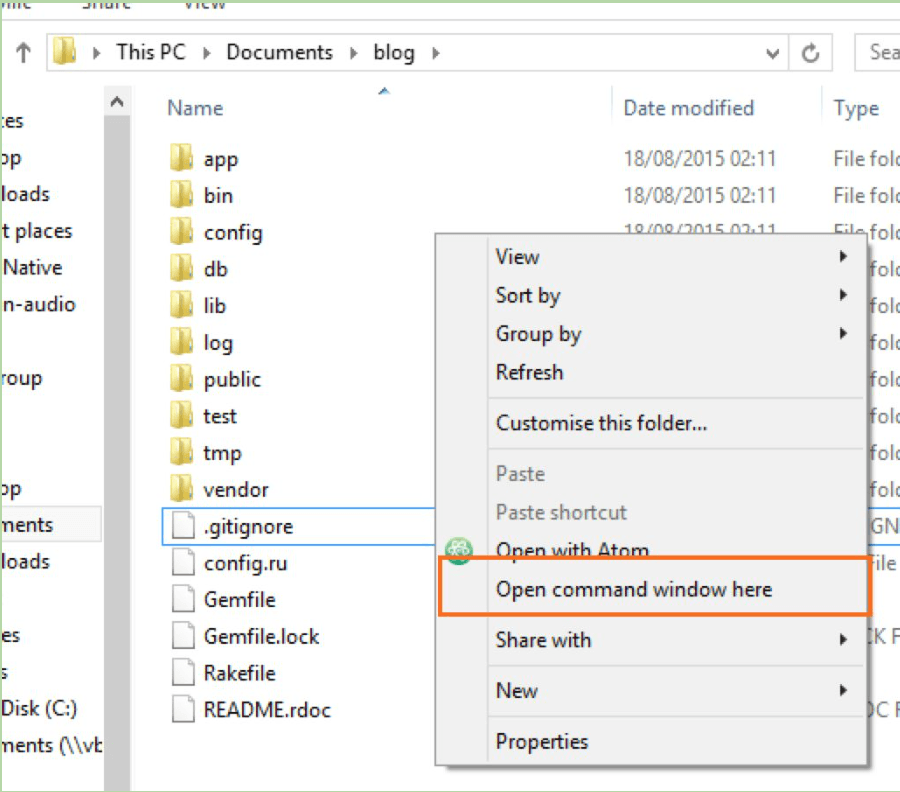
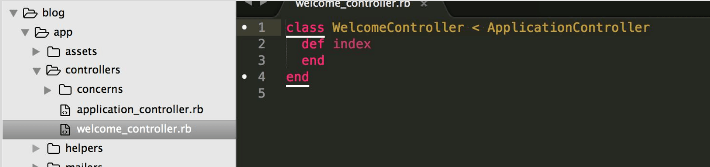
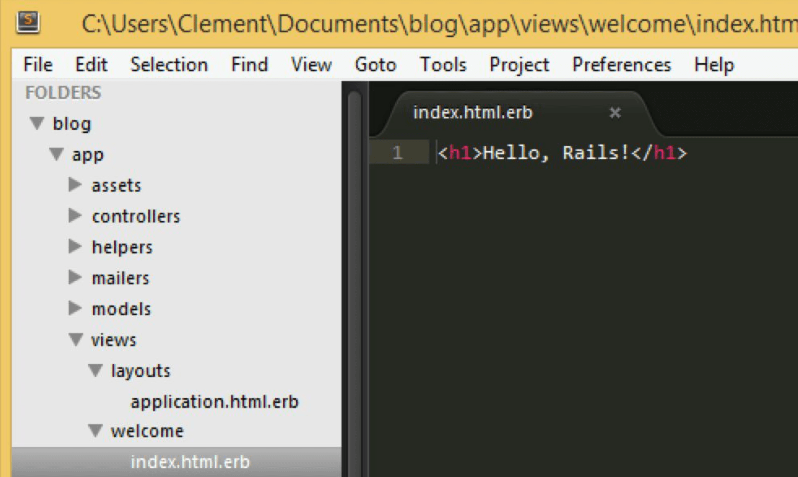
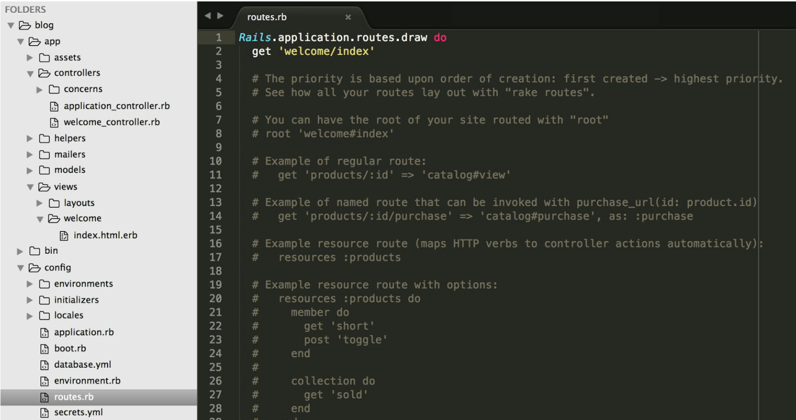
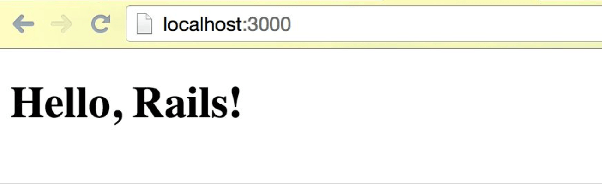

---
title: "Hello Rails"
slug: hello-rails
---     

To get Rails saying "Hello", we need to create at minimum a **controller** and a **view**. Rails helps us to set up both using the terminal.

A **controller** takes requests from the user and decides what to do with them.
A **view** displays information in the browser, so that humans (that's us!) can understand it.

> [info]
> **What is a request?**
<br/>
<br/>
> When you go to a website, you're asking a far away different computer for an HTML/CSS file. When you type [http://localhost:3000](http://localhost:3000) it will ask your computer for the HTML file instead.

Ok, so let's get started on making a controller. This is very easy as Rails will help us with this. Oh but wait! Right now, we have our web server running in our terminal. Instead of stopping it, let's open a second terminal tab or window. You can do this by typing **Cmd + T** in the Mac terminal and it will open a new tab.

> [win]
> **For Windows Users**
<br/>
<br/>
> In Windows, go to your folder in your file explorer.
>
> 
>
> Click into the folder **blog** and **Shift + Right click** to get this menu:
>
> 
>
> **!!!** Shift is the key that you use to capitalize letters.
>
> Click the option "Open command window here" and it will open a new command prompt for you with the correct folder path.

Now type the following command into the terminal:

`$ bin/rails generate controller welcome index` (Mac OSX)
<br/>
`$ ruby bin/rails generate controller welcome index` (Windows)

and press **enter**. This will create a controller called **welcome** with an action called **index** inside of it. Open the **welcome_controller** in your Sublime Text 2 editor and have a look for yourself. You can find it under */blog/app/controllers*.



Now, let's have a look at the view and modify it.

Open the **index.html.erb** file that is located under */blog/app/views/welcome*. Delete all of the existing code in the file, and replace it with this single line of code.

`<h1>Hello, Rails!</h1>`

The file now should look like this:



If you refresh the browser now, nothing will happen. At the moment, the default "Welcome aboard" message is occupying the welcome spot.

Let's connect our new controller with the new view.

Open the file **routes.rb** that you can find in the */config* folder.



This file looks very busy but not to worry. The grey text is code that has been commented out and is only there as an example. It will help us too!

Find the line (line 8 in the picture) that shows

`# root 'welcome#index'`

and remove the **#**. This makes the code active and the line should now look like this

`root 'welcome#index'`


> [win]
> **For Windows Users**
<br/>
<br/>
> Open the file */blog/app/views/layouts/**application.html.erb*** and change it to the following (in italics):

```html
<!DOCTYPE html>
<html>
  <head>
    <title>Blog</title>
    <%= stylesheet_link_tag 'application', media: 'all', 'dataturbolinkstrack' => true %>
    <%= javascript_include_tag 'default', 'dataturbolinkstrack' => true %>
    <%= csrf_meta_tags %>
  </head>
  <body>
  <%= yield %>
  </body>
</html>
```

If you now **save your file** and reload the browser, you should see your "Hello Rails" message.



Awesome, so let's continue and get some articles into our blog.
