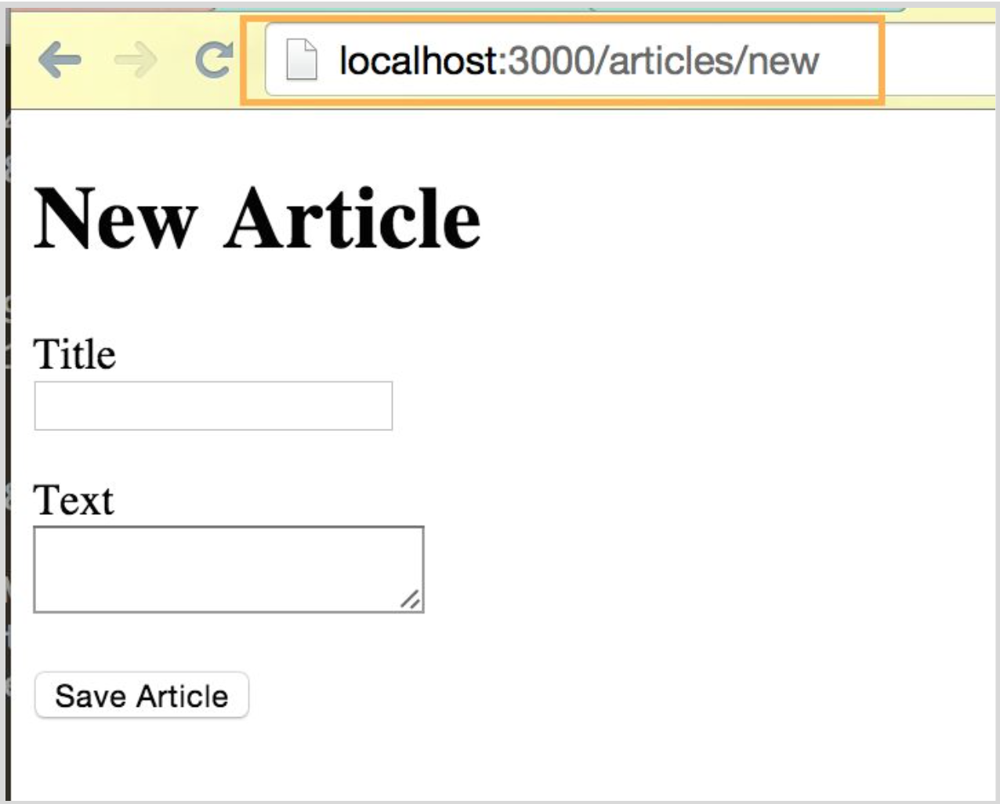

---
title: "Making Resources"
slug: making-resources
---     

We already had our */config/**routes.rb*** file open, so edit it a little bit more. Add this line to the file:

```ruby
Rails.application.routes.draw do
    resources :articles

    root 'welcome#index'
end
```

PS: We removed all the greyed out code from the file to make it easier to read. You can just copy and paste the above lines and remove everything else.

Now we are going to use more Rails magic. Let's go back to the terminal and type

`$ bin/rake routes` (Mac OSX)
<br/>
`$ ruby bin/rake routes` (Windows)

and press **enter**. Rails will now create new web addresses for our blog. The web addresses we will use are

[http://localhost:3000/articles](http://localhost:3000/articles) - this will show all the articles
<br/> 
[http://localhost:3000/new](http://localhost:3000/new) - this will show the form to create an article
<br/> 
[http://localhost:3000/articles/:id](http://localhost:3000/articles/:id) - this will show us only one article

Now that we have the routes, let's make our basic form, which will look something like this:


It will look a little basic for now, but that's ok. We'll make it look awesome later.

Firstly, we need a place within the application to create a new article. A great place for that would be at */articles/new*. Rails has already created the route for us, so we just need to create the **controller** and **view** for it.

Let's create an ArticlesController by using some Rails magic in the terminal again. Type the following: 

`$ bin/rails generate controller articles` (Mac OSX)

`$ ruby bin/rails generate controller articles` (Windows)

and ... you know it ... press **enter**. Let's open the newly created controller and add a new action.

> [info]
> **What are actions?**
<br/>
> In object-oriented programming, a **method** is a programmed procedure that is defined as part of a class and included in any object of that class. In Ruby, methods are called **actions**.

The code should look like this in the **articles_controller.rb**, which you can find under */blog/app/controllers*.

```ruby
class ArticlesController < ApplicationController
  def new
  end
end
```

We also need a view to create an article, so let's go ahead and create a new file. As it is a view, it should live under */views/articles* in the */app* folder. Let's name it **new.html.erb** as it will create new articles.


Now type **Cmd + S** (Mac OSX) or **Ctrl + S** (Windows) to save the file and name it:


Press **enter** when you typed the filename and the file will appear in the directory. Now let's put some HTML into the new file:

```html
<h1>New Article</h1>
<%= form_for :article, url: articles_path do |f| %>
  <p>
    <%= f.label :title %><br>
    <%= f.text_field :title %>
  </p>
  <p>
   <%= f.label :text %><br>
    <%= f.text_area :text %>
  </p>
  <p>
    <%= f.submit 'Save Article' %>
  </p> 
<% end %>
```

If you now navigate to the new URL [http://localhost:3000/articles/new​](http://localhost:3000/articles/new​) you will see the new form. It really is that easy to make a form!



> [info]
> **Ruby vs HTML syntax**
<br/>
> In HTML, the tags we use to make a web page use these **< >** brackets.
<br/>
> Example: `<h1>Hello</h1>`
> 
> In Ruby, the same brackets are used but they are followed with the **%** sign.
<br/>
> Example: `<=% ... %>`

Click the **Save Article** button now to see what happens.


Oh no, we got an error! This is because we have not defined the **create** action in the controller yet. Let's do that now.

Open the **articles_controller.rb** again and add this code to it:

```ruby
class ArticlesController < ApplicationController
  def new
  end
  
  def create
    render plain: params[:article].inspect
  end
end
```

Enter some details into the form and click the **Save Article** button now. You should be getting something like this in your browser:


This is already really great but not very useful when building a blog. We want to save this data in a database to then show it on a website. So let's build the last building block to a complete web application.
