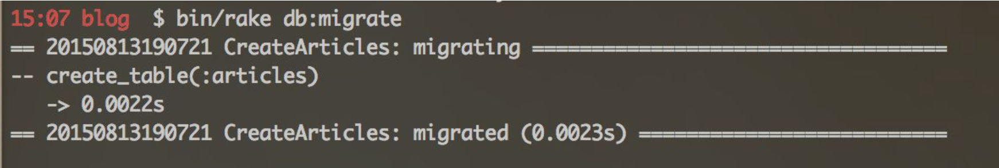

---
title: "The Datebase and Models"
slug: database-and-models
---     

A database stores data in a table like structure.

<table>
  <tr>
    <th>Name</th>
    <th>Birthday</th>
    <th>Country</th>
  </tr>
  <tr>
    <td>Bart Simpson</td>
    <td>Jan 7, 1995</td>
    <td>USA</td>
  </tr>
  <tr>
    <td>Monkey Luffy</td>
    <td>Aug 21, 1992</td>
    <td>Japan</td>
  </tr>
</table>

This simple table could be stored in a database. Each row represents the data for a single person. In Rails, a row is equivalent to a model.

Thankfully Rails helps us with the creation of a database and models for our articles. Open the terminal again and type:

`$ bin/rails generate model Article title:string text:text` (Mac OSX)

`$ ruby bin/rails generate model Article title:string text:text` (Windows)

Quick reminder: **Don't** type the **$**. And don't forget to press **enter**.


When the terminal is finished, let's run a database migration, which will create our database table. To do that, type

`$ bin/rake db:migrate` (Mac OSX)

`$ ruby bin/rake db:migrate` (Windows)

which will look like this in the terminal:



And that's already it. We just set up a database!

Ok, now that we have our database, we want to save our data from the form in it. Open **articles_controller.rb** again and let's modify the **create** action to look like this:

```
class ArticlesController < ApplicationController
  def new
  end

  def create
    @article = Article.new(params.require(:article).permit(:title, :text))
     
    @article.save
    redirect_to @article
  end
end
```

Here is what's going on:

The first new line connects our new article (the one we type into the form) to an ID (just like your passport number).

**@article.save** is responsible for saving the model in the database. Finally, we redirect the user to the show action, which we'll define now in the same file.

```
class ArticlesController < ApplicationController
  def show
    @article = Article.find(params[:id])
  end

  def new
  end

  def create
    @article = Article.new(params.require(:article).permit(:title, :text))
     
    @article.save
    redirect_to @article
  end
end
```

We're almost done now, we just need one more view for the **show** action, so let's create a new file now called **show.html.erb** inside the */blog/app/views/articles* folder. 

```
<p>
  <strong>Title:</strong>
  <%= @article.title %>
</p>
<p>
  <strong>Text:</strong>
  <%= @article.text %>
</p>
```

Once you have done this, go back to the browser, type a nice article (preferably about cats but it can be anything) and click the **Save Article** button. You should see something like this:


Awesome! You just created and saved articles in a blog. Here's a unicorn for you! You deserve it!


