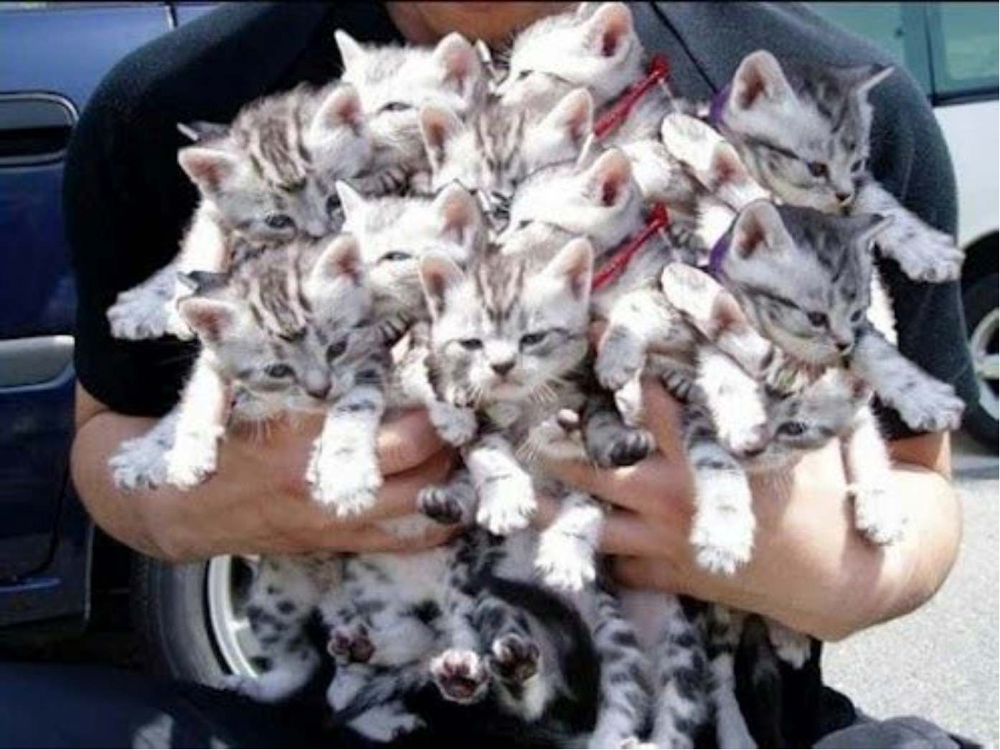
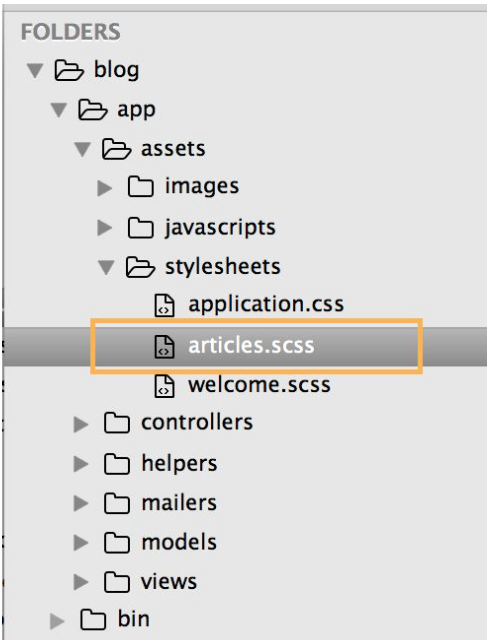
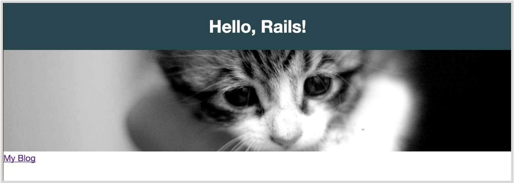

---
title: "Making It Look Awesome"
slug: making-it-look-awesome
---     

We need to have a lot more cats to make our site look awesome! So, let's add them and a bunch of CSS to make our blog look more professional.

In Rails, there's a folder for CSS spreadsheets and we will modify the **articles.scss** file that was auto-generated for us by Rails. You can find it here:

Let's put some CSS rules into the file to make our page look great. First we add some classes to HTML tags as we want these consistent across our whole page.

    body {
      margin: 0;
      font-family: proxima-nova, 'Helvetica Neue', Helvetica, Arial, sans-serif;
    }
    h1 {
      text-align: center;
      background-color: #2A4550;
      color: white;
      margin: 0;
      padding: 24px;
    }

Those two rules will set the font-family for the whole page to a modern font family, which will instantly make your page look more modern and sophisticated.

The **h1** rule gives the header a nice padding and a background color, which will make the page look more like a web page and not a page printed on paper.

> [info]
> **CSS Basics**
 
> Remember that there are 3 different ways to set rules with CSS. 
 
 
> *tags*
 
> You can use HTML tags directly to see a CSS rule on them. This is only recommended for tags that you know will be the same across the whole web page, like font color or font-size for example. It's usually good practice to keep them consistent across the whole page.
 
 
> *class*
 
> This is commonly the best way to apply CSS rules. Classes are reusable and can be applied to many different elements. If you have a button style, then you would want that style on all buttons across your page, so using classes would be the best option. 
 
 
> *id*
 
> Ids are used when you want to apply a style to only one element ever. They can't be reused for other elements, so use them wisely.

To make the web page stand out a bit more, we added a picture to it. You can do that by adding the following HTML under the **`<h1>`** tags on every page:

``

Add this to the files under */views/articles/*: **new.html.erb** and **index.html.erb** and under */views/welcome/*, **index.html.erb**.

You can of course put any image URL you want to put. We just chose cats because cats are awesome!

> [info]
> **What's a URL?**
 
> A URL is the text that you type into the browser to get a web page. [http://makeschool.com](http://makeschool.com) is a URL. URL stands for **Uniform Resource Locator**, and is used to specify addresses on the World Wide Web.

Add this CSS to your **articles.scss** file:

    img {
      max-width: 100%;
      height: auto;
      margin-bottom: 24px;
    }

It will make sure that your image resizes with your page and is not too big.

See your blog looks already almost like a professional cat blog.
