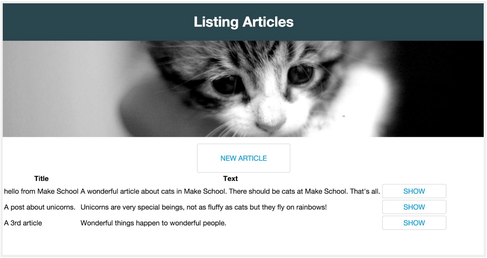
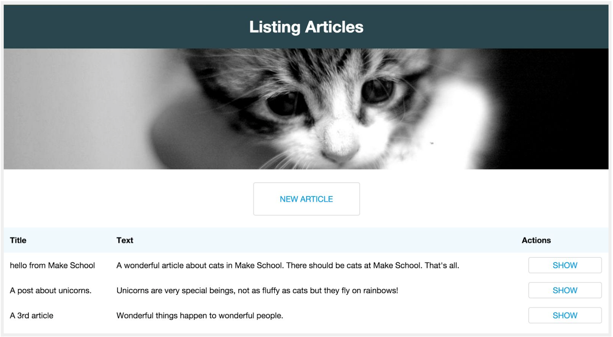
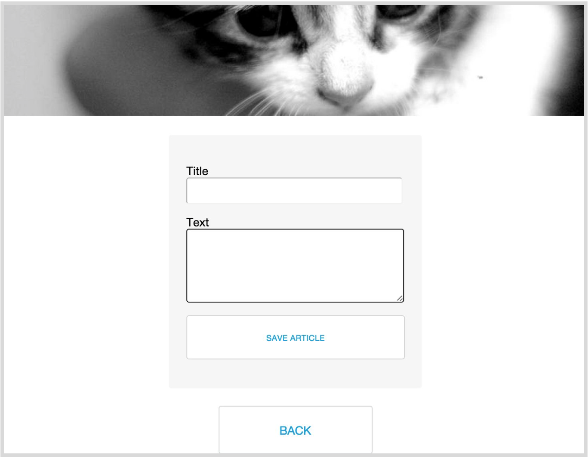
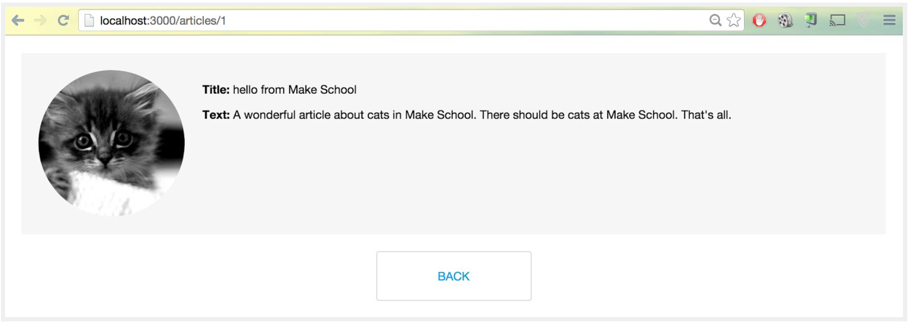

---
title: "Using CSS Classes"
slug: using-css-classes
---     

Now, let's add a few classes to position things a bit better and make them look better.

Add this CSS to make the links button shaped:

```css
.button {
  text-decoration: none;
  border-radius: 4px;
  border: 1px solid #d1d3d5;
  color: #009BDB;
  text-transform: uppercase;
  background-color: #FFFFFF;
  display: block;
  text-align: center;
  margin: auto;
  width: 120px;
}

.button:hover {
  color: #FFFFFF;
  background-color: #009BDB;
}

.big {
  padding: 23px 45px;
}

.small {
  padding: 6px 12px;
}
```

The first rule styles the links into buttons, the second rule only takes effect when you hover over the button, which is why it uses the special syntax with the colon **:hover**.

The last two rules just apply different sizes to the buttons.

Now add the classes **big** and **button** to all the links, like this:

`<%= link_to 'New Article', new_article_path, class: "big button" %>`

That should be the files: */views/welcome/**index.html.erb***, and all the views in */views/articles/*: **index.html.erb**, **new.html.erb** and **show.html.erb**.

We've used the classes **small** and **button** for the links inside the table.

`<td><%= link_to 'Show', article_path(article), class: "small button" %></td>`

This should make the page already look like this:



That already looks loads better! Now let's position a few things to make them more central to our web page. 

Add the following rules to your CSS: 

```css
table {
  width: 100%;
  border-spacing: 0;
  margin: 24px auto 0 auto;
}

tr {
  height: 50px;
  border-bottom: 1px solid #d1d3d5;
}

th {
  text-align: left;
  background-color: #F0F8FF;
  padding-left: 12px;
}

td {
  padding-left: 12px;
}
```

These rules change the table elements to look a bit more spaced out, which is easier to read and give a background-color to the table header.



Can you come up with more rules to make it look even better? Maybe add more pictures?

As we have styled the first two pages, we should also give a bit of styling to the **New Article** page, which contains the form. Add these lines to your CSS:

```css
form {
  margin: auto;
  width: 300px;
  background-color: #F5F5F5;
  padding: 24px;
  border-radius: 4px;
  margin-bottom: 24px;
}

#save-button {
  border-radius: 4px;
  border: 1px solid #d1d3d5;
  color: #009BDB;
  text-transform: uppercase;
  background-color: #FFFFFF;
  padding: 23px 109px;
  height: auto;
}

#save-button:hover {
  color: #FFFFFF;
  background-color: #009BDB;
}

input,
textarea {
  width: 98%;
  height: 2rem;
  border-radius: 4px;
}

#article_text {
  height: 6rem;
}
```

And let's also add the id **save-button** to the "Save Article" button on **new.html.erb**.

`<%= f.submit 'Save Article', id: "save-button" %>`

Refresh the **New Article** page. It should now look like this:



And last but not least, add this CSS for the **show.html.erb** page:

```css
.container {
  background-color: #F5F5F5;
  padding: 24px;
  margin: 24px;
  min-height: 200px;
}

.mini-img {
  height: 200px;
  border-radius: 100px;
  float: left;
  margin-right: 24px;
}
```

Those classes will take effect if you add the following HTML to **show.html.erb**:

```html
<div class="container">
  
  <p>
    <strong>Title:</strong>
    <%= @article.title %>
  </p>
  <p>
    <strong>Text:</strong>
    <%= @article.text %>
  </p>
</div>

<%= link_to 'Back', articles_path, class: "big button" %>
```

And yes, we snuck one more cat in there. We just had to. Your web page should look like this now:



Feel free to add anything else you want, maybe another picture? Or change the font color to your favourite color. [Here](https://goo.gl/s0gma7)'s a list of all the CSS rules out there, it might give you some ideas what else you could do.


