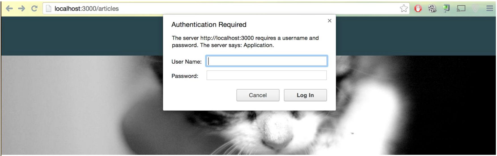

---
title: "Bonus 1 - Basic Authentication"
slug: basic-auth
---     

If you were to publish your blog online, anyone would be able to add articles. Rails provides a very simple **HTTP authentication system** that will work nicely in this situation.

> [info]
> **What is HTTP?**
<br/>
> When you enter a URL in your browser, this sends an HTTP command to the Web server directing it to fetch and transmit the requested Web page. HTTP stands for **HyperText Transfer Protocol**.

Open the **articles_controller.rb** again and add the following line of code at the top of the file:

```ruby
class ArticlesController < ApplicationController
  
  http_basic_authenticate_with name: "alena", password: "secret", except: [:index, :show]
  
  def index
    
. . . shortened for brevity . . .
end
```

You can of course change your name and password!

When you reload the **Listing Articles** page now and click on the **New Article** button, you should get a popup similar to this:



And that's already it. How easy was that?!