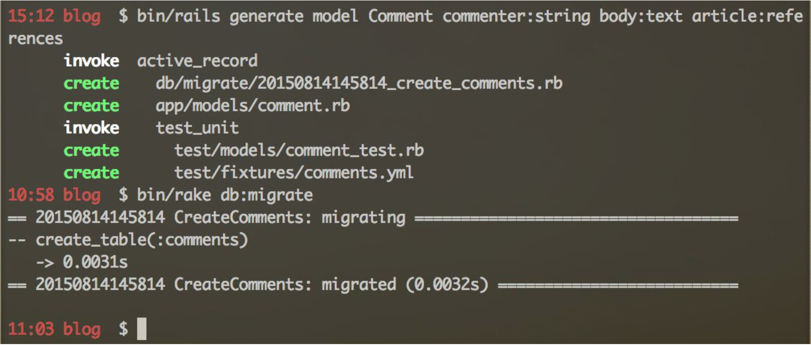
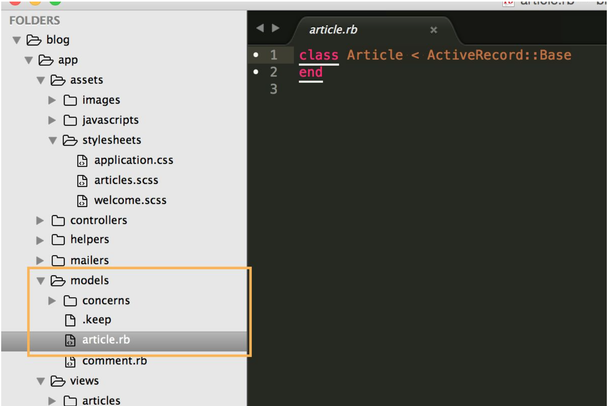

---
title: "Bonus 2 - Adding Comments"
slug: adding-comments
---     

Ok, so now we have our blog up and running. One thing that is very common when having blogs is the ability to add comments at the bottom. You do want to know if people are loving what you are saying, don't you? So let's add comments to each article!

The first thing we need to do is add another model and database table for the comments. Let's do that with the same Rails command in the terminal as before:

`$ bin/rails generate model Comment commenter:string body:text article:references` (Mac OSX)

`$ ruby bin/rails generate model Comment commenter:string body:text article:references` (Windows)

Rails will generate the model and database table for us and we just need to migrate the database table. So let's do that by typing the following command into the terminal and press “enter”:

`$ bin/rake db:migrate` (Mac OSX)

`$ ruby bin/rake db:migrate` (Windows)

Both commands together should look something like this:



Ok, so now we want to connect our comments to our articles. This is called **associating models**. In our case, Rails already connected our comments to our articles but we also need to make sure that each article knows about its comments. To do that, we need to add the association to **article.rb**, which you can find in the */models* folder.



Let's add the following line:

```ruby
class Article < ActiveRecord::Base
  has_many :comments
end
```

We also need to tell our router that an article has comments. Open */config/**routes.rb*** and add the following: 

```ruby
Rails.application.routes.draw do

  resources :articles do
    resources :comments
  end
  
  root 'welcome#index'
end
```

This creates comments as a nested resource within articles. Here's a good way to remember the relationship between articles and comments:

*Each* comment belongs to *one* article.

*One* article can have *many* comments.

That is what we set up when we added the above lines. Now let's make the comments controller and a view. Back in the terminal, we let Rails magic do this for us by typing:

`$ bin/rails generate controller Comments` (Mac OSX)

`$ ruby bin/rails generate controller Comments` (Windows)

Open the **comments_controller.rb** and add the **create** action, which will allow us to save the comments in our database:

```ruby
class CommentsController < ApplicationController
  def create
    @article = Article.find(params[:article_id])
    @comment = @article.comments.create(comment_params)
    redirect_to article_path(@article)
  end
 
  private
    def comment_params
      params.require(:comment).permit(:commenter, :body)
    end
end
```

Now, let's add a form to **show.html.erb**, so we can add and show comments:

```html
<div class="container">
  
  <p>
    <strong>Title:</strong>
    <%= @article.title %>
  </p>   
  <p>
    <strong>Text:</strong>
    <%= @article.text %>
  </p>
</div>

<div class ="container">
  <h2>Comments</h2>

  <% @article.comments.each do |comment| %>
    <p>
      <strong>Commenter:</strong>
      <%= comment.commenter %>
    </p>
    <p>
      <strong>Comment:</strong>
      <%= comment.body %>
    </p>
  <% end %>
</div>

<div class="container">
  <h2>Add Comment</h2>

  <%= form_for([@article, @article.comments.build]) do |f| %>
    <p>
      <%= f.label :commenter %><br>
      <%= f.text_field :commenter %>
    </p>
    <p>
      <%= f.label :body %><br>
      <%= f.text_area :body %>
    </p>
    <p>
      <%= f.submit "Create Comment", :id => "save-button" %>
    </p>
  <% end %>
</div>
<%= link_to 'Back', articles_path, class: "big button" %>

```

With the form in place, we just need to change a couple of CSS rules and it will look more consistent. Open **articles.scss** and change the following rules:

```css
. . .

h1,
h2 {
  text-align: center;
  background-color: #2A4550;
  color: white;
  margin: 0;
  padding: 24px;
}
. . .

#article_text,
textarea {
  height: 6rem;
}

. . .
```

And that's already it! You've added the ability to create comments and show them under each article. Well done! More unicorns and cats for you - or we should say a unicorn cat!

